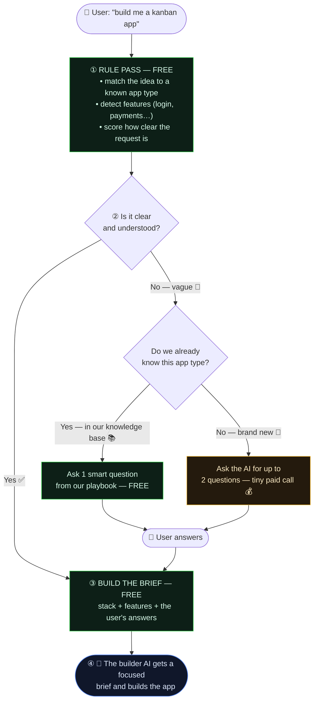

# 🧠 The Project Intake Engine — explained simply

> **In one sentence:** when someone starts a new project, Helix has a short, smart
> conversation to understand what they want **before** spending money on AI — so the
> very first build is closer to right, and we waste as little as possible.

This page is written for **everyone** — no coding needed.

---

## The big idea: a triage nurse and a specialist 🏥

Think of a hospital:

- A **triage nurse** (fast, free) handles every patient, knows the routine cases by
  heart, and only sends the genuinely tricky ones to a specialist.
- A **specialist doctor** (expensive) is called **only** when truly needed — and when
  they are, they get the patient's full chart so they work fast.

Our engine works the same way:

- **The "nurse" = free rules + a knowledge base.** It recognizes the app, fills in the
  obvious details, and asks the right question — costing **nothing**.
- **The "specialist" = the AI.** It's only called for unfamiliar requests, and we hand
  it everything the rules already figured out, so its one small call is cheap and sharp.

---

## How it flows

**Green = free. Yellow = the only step that ever costs AI money — and only sometimes.**

---

## Walking through it in plain English

1. **You describe your idea** — even just *"a kanban app."*
2. **The rule pass (free)** recognizes it's a *kanban board*, knows that usually means
   drag-and-drop + saving your work, and notices you didn't mention much detail.
3. **The gate decides:**
   - If you gave a **clear, detailed** request → skip the AI entirely and build. **$0 extra.**
   - If it's **vague** → ask **one** good question. If it's an app type we already know,
     the question comes from our **playbook (free)**. Only a truly new idea calls the AI.
4. **The brief is assembled (free)** from the stack, the features, and your answer.
5. **The builder AI** receives a tight, focused brief and builds the app — on target.

---

## Why this saves money 💸

The expensive part isn't the *questions* — it's **wrong first builds**. Without this,
the AI guesses, builds the wrong thing, and the user redoes it 4–5 times — and each redo
is an expensive AI turn. By spending a few cents (or **nothing**) up front to nail the
target, we avoid those costly do-overs. **The cheaper the curation, the bigger the win.**

---

## The knowledge base (the "playbook") 📚

The nurse is smart because of three small, hand-written lookup tables:

| Table | What it holds | Example |
|------|----------------|---------|
| **Archetypes** | app type → recommended stack, default features, best question | *kanban → Next.js, drag-and-drop, "shareable or just yours?"* |
| **Synonyms** | different wordings → one meaning | *"trello", "jira" → kanban; "sign-in" → login* |
| **Implications** | one feature → what it needs | *payments → also needs login + a database* |

These are curated by hand (a few kilobytes), so they're accurate and **free to use**.
As we learn new app types, we add them — and the engine gets smarter without getting
more expensive.

---

*Source of truth: `src/lib/intake.ts` (engine) and `src/lib/intake-knowledge.ts`
(the playbook). This document is rendered live in the admin **Architecture** section.*
